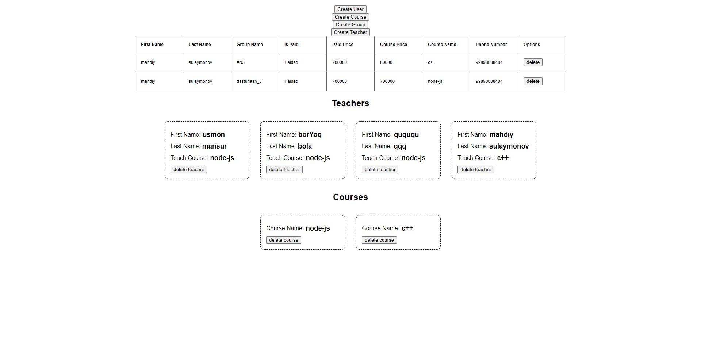

# CRM-SQL

# CRM 101: What is CRM?
This is a simple definition of CRM.
Customer relationship management (CRM) is a technology for managing all your company’s relationships and interactions with customers and potential customers. The goal is simple: Improve business relationships to grow your business. A CRM system helps companies stay connected to customers, streamline processes, and improve profitability.

When people talk about CRM, they are usually referring to a CRM system, a tool that helps with contact management, sales management, agent productivity, and more. CRM tools can now be used to manage customer relationships across the entire customer lifecycle, spanning marketing, sales, digital commerce, and customer service interactions.

A CRM solution helps you focus on your organization’s relationships with individual people — including customers, service users, colleagues, or suppliers — throughout your lifecycle with them, including finding new customers, winning their business, and providing support and additional services throughout the relationship.

# Who is CRM for?
A CRM system gives everyone — from sales, customer service, business development, recruiting, marketing, or any other line of business — a better way to manage the external interactions and relationships that drive success. A CRM tool lets you store customer and prospect contact information, identify sales opportunities, record service issues, and manage marketing campaigns, all in one central location — and make information about every customer interaction available to anyone at your company who might need it.

With visibility and easy access to data, it's easier to collaborate and increase productivity. Everyone in your company can see how customers have been communicated with, what they’ve bought, when they last purchased, what they paid, and so much more. CRM can help companies of all sizes drive business growth, and it can be especially beneficial to a small business, where teams often need to find ways to do more with less.

# My CRM preview

